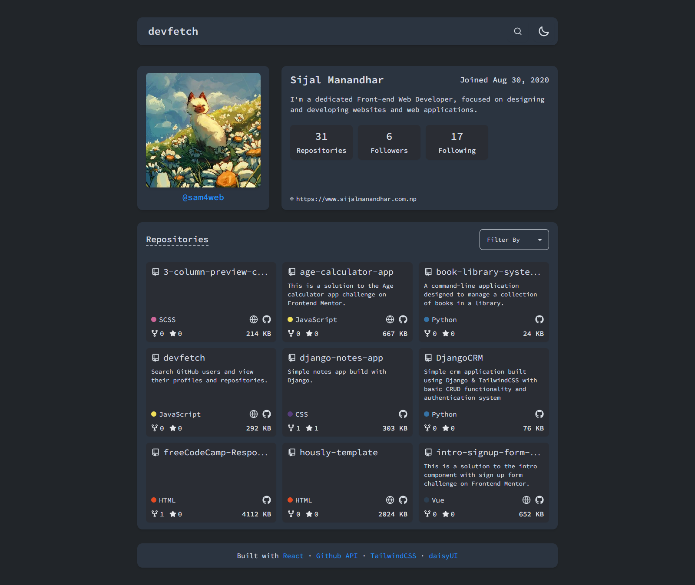

# GitFinder

GitFinder lets you search GitHub users and view their profiles and repositories. It is a simple web application built with React, TailwindCSS, and Zustand for state management. It allows you to search for GitHub users and view their details and repositories.

## Features

- **Search GitHub Users**: Easily find GitHub users by their username.
- **View User Details**: See detailed information about GitHub users, including their profile and repositories.
- **Sort Repositories**: Organize repositories based on stars, size, and forks.
- **Theme Toggle**: Switch between light and dark themes for a better viewing experience.

## Features

- User Search: Search for GitHub profiles using usernames and display basic profile information (profile picture, bio, number of repositories, followers).
- Repository Details: List all repositories of a user with details like name, description, stars, forks, language, and last updated date.
- Contribution Calendar: Visualize the user's contribution calendar to show daily contributions over the past year.

## Technologies Used

- **React**: For building the user interface.
- **TailwindCSS**: For styling the application.
- **GitHub Calendars**: For displaying contribution data.
- **Zustand**: For managing the application state.

## Links

- Source Code: [GitHub Repository](https://github.com/NitinSemwal2605/GitFinders-A-Gateway-to-GitHub)
- Live Demo: [GitFinder Live](https://gitfinders.vercel.app/)

## Screenshot

---

Feel free to replace the placeholder links and screenshot path with the actual ones. Let me know if you need any further adjustments!
